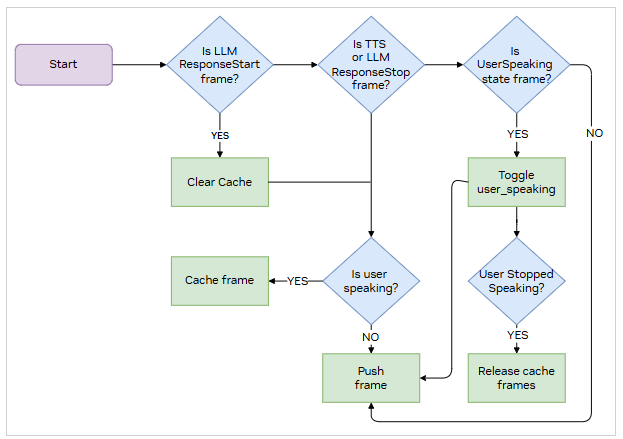

# Speculative Speech Processing

## Overview

Speculative speech processing enables real-time, natural conversational AI by processing interim transcripts and generating early responses while maintaining conversation coherence. This implementation uses NVIDIA's specialized frame processors and context aggregators to create fluid, responsive conversational experiences.

## What is Speculative Speech Processing?

Speculative speech processing allows the system to begin processing and responding to user input before the complete utterance is finalized. By analyzing interim transcripts with high stability scores, the system can:

- Generate responses with lower latency
- Maintain natural conversation flow
- Reduce perceived wait times
- Create more engaging user experiences

## Key Components that Enable Speculative Speech Processing

This implementation relies on three core components that work together to enable speculative speech processing:

### NvidiaUserContextAggregator

**Purpose:** Handles user speech processing and manages conversation context.

**Key Capabilities:**
- Processes both interim and final transcripts from the ASR system
- Filters stable interim transcripts (stability=1.0) for early processing
- Manages user speaking state to coordinate response timing
- Maintains conversation history with configurable limits
- Deduplicates repeated transcripts to prevent redundant processing

### NvidiaAssistantContextAggregator

**Purpose:** Manages assistant responses and ensures conversation coherence.

**Key Capabilities:**
- Updates existing responses as more context arrives
- Maintains strict user-assistant turn-taking protocol
- Ensures conversation coherence during speculative processing
- Coordinates with user context for proper timing
- Prevents response conflicts and overlapping turns

### NvidiaTTSResponseCacher

**Purpose:** Controls text-to-speech response timing and delivery.

**Key Capabilities:**
- Controls response timing and delivery to prevent interruptions
- Buffers TTS responses while the user is speaking
- Prevents response overlap during interim transcription processing
- Coordinates response release with user speech state
- Manages interruptions and response cancellation gracefully

## How It Works

### Transcript Processing Flow

1. **Interim Transcripts**: As the user speaks, the ASR system generates tentative hypotheses about what was said. These interim transcripts may change as more audio is processed.

2. **Stability Assessment**: Each interim transcript includes a stability parameter that estimates the likelihood that the recognizer will not change its guess about the result.
   - **Stable interims** (stability = 1.0): High confidence transcripts ready for speculative processing
   - **Unstable interims/Partials** (stability < 1.0): Low confidence transcripts that may still change

3. **Final Transcripts**: The last hypothesis returned by the ASR system, marked with `is_final=True`, represents the most stable and definitive transcription.

## Workflow


As the user speaks, the system receives interim transcripts from the speech-to-text engine as `RivaInterimTranscriptionFrames`. Each `RivaInterimTranscriptionFrame` includes a stability score indicating the likelihood of the transcription remaining unchanged.

The `NvidiaUserContextAggregator` processes only stable interim transcripts (stability=1.0) to prevent processing unstable or rapidly changing transcriptions. When a final transcript arrives, it replaces any interim transcripts for that utterance if the content of the final transcript is different from the received interims before it.

In addition, the `NvidiaUserContextAggregator` maintains conversation history using a dynamic update mechanism. Instead of always appending new messages, it updates existing messages when appropriate. This approach helps maintain conversation coherence while enabling early response generation for speculative speech scenarios. The system enforces strict user-assistant turn-taking to ensure natural conversation flow where each user query is strictly followed by an assistant response entry.


After transcript filtration and conversation history management from `NvidiaUserContextAggregator`, transcriptions are sent downstream to LLM and TTS services as `OpenAILLMContextFrame`.

After responses are generated from TTS service, `NvidiaTTSResponseCacher` manages their delivery timing. While the user is speaking, TTS responses are cached rather than immediately played. This caching mechanism prevents response overlap and maintains natural turn-taking. When the user stops speaking, cached responses are released in the appropriate order, creating a more natural conversational experience.



### Example Pipeline Configuration

```python
nvidia_tts_response_cacher = NvidiaTTSResponseCacher()

pipeline = Pipeline([
    transport.input(),                      # Input from client
    stt,                                    # Speech-to-Text [RivaASRService]
    nvidia_context_aggregator.user(),       # Handle interim/final transcripts
    llm,                                    # Language Model
    tts,                                    # Text-to-Speech [TTS service]
    nvidia_tts_response_cacher,            # Response timing control
    transport.output(),
    nvidia_context_aggregator.assistant()   # Response management
])
```

### Configuration Options

```python
nvidia_context_aggregator = create_nvidia_context_aggregator(
    context,
    send_interims=True,      # Enable interim processing
    chat_history_limit=20,   # Conversation turn limit
)
```

## Enabling Speculative Speech Processing

Speculative speech processing is enabled through a simple environment variable configuration. When enabled, the system processes the final as well as the stable interim transcripts and follows a strict turn-taking approach where responses are generated even before the user completes their utterance based on hypothesized transcripts from Riva ASR Service (the interim transcripts).

### Configuration Using Environment Variable

The feature is controlled by the `ENABLE_SPECULATIVE_SPEECH` environment variable in the shared examples. The application automatically switches processors based on this flag—no code edits are needed.

**For Docker Compose deployments:**

Set the environment variable in your `docker-compose.yml` under the `python-app` service:

```yaml
environment:
  - ENABLE_SPECULATIVE_SPEECH=${ENABLE_SPECULATIVE_SPEECH:-false}
```

**For local runs:**

Export the environment variable before launching the application:

```bash
# Enable speculative speech processing
export ENABLE_SPECULATIVE_SPEECH=true
python bot.py

# Disable speculative speech processing
export ENABLE_SPECULATIVE_SPEECH=false
python bot.py
```

### How It Works

When you set `ENABLE_SPECULATIVE_SPEECH=true`, the application automatically:

1. **Configures the context aggregator** with `send_interims=True` to process interim transcripts
2. **Adds `NvidiaTTSResponseCacher`** to the pipeline for response timing control
3. **Enables interim transcript processing** with proper conversation history management

The implementation dynamically switches between two configurations:

**With Speculative Speech Enabled (`ENABLE_SPECULATIVE_SPEECH=true`):**
```python
context_aggregator = create_nvidia_context_aggregator(context, send_interims=True)
tts_response_cacher = NvidiaTTSResponseCacher()

pipeline = Pipeline([
    transport.input(),
    stt,
    context_aggregator.user(),
    llm,
    tts,
    tts_response_cacher,                  # Caches responses during user speech
    transport.output(),
    context_aggregator.assistant()
])
```

**With Speculative Speech Disabled (`ENABLE_SPECULATIVE_SPEECH=false`):**
```python
context_aggregator = llm.create_context_aggregator(context)

pipeline = Pipeline([
    transport.input(),
    stt,
    context_aggregator.user(),
    llm,
    tts,
    transport.output(),
    context_aggregator.assistant()
])
```

### Expected Improvements

After enabling speculative speech processing:

- **Interim transcripts will be processed**: Response generation starts after the first stable interim transcript is received
- **Speculative caching**: TTS responses are speculatively cached until the user stops speaking
- **Reduced latency**: Early response generation takes place on the basis of interim transcripts, decreasing overall pipeline latency by parallelizing LLM, RAG, and TTS services. You should expect an approximately **300 ms reduction** in end-to-end latency
- **Improved context management**: Support for interim updates with dynamic conversation history
- **Performance trade-off**: Potentially decreased response latency; however, it slightly increases processing overhead

> **Note:** This feature only works when using Riva ASR. Ensure your ASR service is configured to provide interim transcripts with stability metrics.

## Building Speculative Speech Processing Specific Frame Processors

When developing features that work with speculative speech processing, it's crucial to design components that can handle both interim and final transcripts while maintaining conversation coherence. The system needs to manage early responses and potential updates.

The following guidelines are useful when building frame processors that lie between the `RivaASRService` and the `NvidiaTTSResponseCacher` frame processor in the pipeline.

**Handle Interim States:**
- Design frames to carry stability information
- Include mechanisms to update or replace interim content
- Implement clear state transitions from interim to final

**Implement Versioning:**
- Support content updates without creating new entries

**Design for Incremental Updates:**
- Support partial response processing
- Design considering `TTSRawAudio` frames are cached by the response caching mechanism until the release conditions are triggered
- Handle response cancellation
- Handle transitions between interim and final states
- Support rollback capabilities

## Technical Foundation

This implementation builds on **NVIDIA Riva ASR's Two-Pass End of Utterance** mechanism, which enables speculative processing through:

- Real-time interim transcript generation with stability metrics
- Sophisticated hypothesis refinement as more audio is processed
- Clear signaling of final transcripts for fallback processing
- Robust handling of partial results and transcript updates

## Learn More

For detailed information about the underlying ASR technology and Two-Pass End of Utterance mechanism, refer to the [NVIDIA Riva ASR documentation](https://docs.nvidia.com/deeplearning/riva/user-guide/docs/asr/asr-overview.html#two-pass-end-of-utterance).