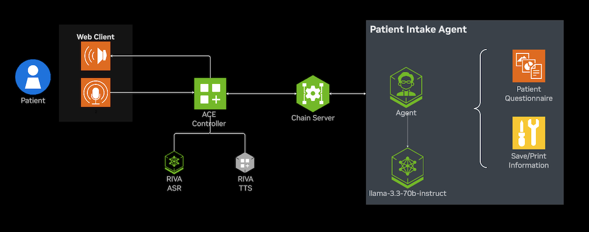

# Agentic Patient Front Desk Assistant

<div align="center">
  
</div>
<div align="center">
  
</div>

In this example, we showcase how to build a patient front desk voice agent pipeline using WebRTC with real-time transcripts. It uses Pipecat pipeline with FastAPI on the backend, and React on the frontend. This pipeline uses a WebRTC based SmallWebRTCTransport, Riva ASR and TTS models and an Agent service. An example recording of the agent interaction with audio can be found [here](./assets/agentic_front_desk_patient_intake.mp4).


## Prerequisites
- A workstation or server with at least 2 NVIDIA RTX GPUs. This example was tested on 2 RTX A6000 GPUs. However, 2 RTX A4000 or equivalent should be sufficient.

- You have access and are logged into NVIDIA NGC. For step-by-step instructions, refer to [the NGC Getting Started Guide](https://docs.nvidia.com/ngc/ngc-overview/index.html#registering-activating-ngc-account).

- You have Docker installed with support for NVIDIA GPUs. For more information, refer to [the Support Matrix](https://docs.nvidia.com/deeplearning/riva/user-guide/docs/support-matrix.html#support-matrix).


## Repository Cloning, Setup API keys and Service Settings

1. Cloning only fetches the main repository (ace-controller), and leaves the submodule [GenerativeAIExamples](https://github.com/NVIDIA/GenerativeAIExamples/tree/main) directory empty. To retrieve the submodule, navigate to the newly cloned ace-controller repository and run:

    ```
    git submodule update --init --recursive
    ```

2. Copy and configure the environment file:

   ```bash
   cp env.example .env  # and add your credentials
   ```

3. Ensure you have the required API keys:
   - NGC_API_KEY - Required for accessing Riva ASR, TTS NIM models (containers on NGC)
   - NVIDIA_API_KEY - Required to access the NVIDIA API catalog [build.nvidia.com](https://build.nvidia.com/) LLM model powering the Agentic Patient Front Desk Assistant (agent)
   - (Optional) ZEROSHOT_TTS_NVIDIA_API_KEY - Required for zero-shot Riva TTS
   - ENABLE_SPECULATIVE_SPEECH=true (default enabled)
   - CONFIG_PATH = ./configs/config.yaml (configuration for the speech pipeline)
   - BASE_URL = "https://integrate.api.nvidia.com/v1" # default to the NVIDIA API catalog [build.nvidia.com](https://build.nvidia.com/) for the Agentic Patient Front Desk Service LLM
   - LLM_MODEL="meta/llama-3.3-70b-instruct" # default LLM for the Agentic Patient Front Desk Service.

# Starting the Agentic Patient Front Desk Assistant Services

There are multiple service components in the agentic patient front desk assistant application.

1. Riva Parakeet ASR Service
2. Riva Magpie TTS Service
3. Agentic Patient Front Desk Service
4. The Speech Service
5. The UI Service

Key components of the services are configured as environment variables in the `.env` file and as configuration parameters under `configs/config.yaml` before deploying the application. 


## Option 1: Deploy Using Docker Compose

From the example/healthcare_voice_agent directory, run:

```bash
docker compose up --build -d
```

Then visit `http://<machine-ip>:9000/` in your browser to start interacting with the application.

Note: To enable microphone access in Chrome, go to `chrome://flags/`, enable "Insecure origins treated as secure", add `http://<machine-ip>:9000` to the list, and restart Chrome.

## Option 2: Deploy Using Python Environment

### Requirements

- Python (>=3.12)
- [uv](https://github.com/astral-sh/uv)

All Python dependencies are listed in `pyproject.toml` and can be installed with `uv`.

### Run

```bash
uv run pipeline.py
```

Then run the ui from [`ui/README.md`](ui/README.md).

## Using Coturn Server

If you want to share widely or want to deploy on cloud platforms, you will need to setup coturn server. Follow instructions below for modifications required in example code for using coturn:

### Deploy Coturn Server

Update HOST_IP_EXTERNAL and run the below command:

```bash
docker run -d --network=host instrumentisto/coturn -n --verbose --log-file=stdout --external-ip=<HOST_IP_EXTERNAL>  --listening-ip=<HOST_IP_EXTERNAL>  --lt-cred-mech --fingerprint --user=admin:admin --no-multicast-peers --realm=tokkio.realm.org --min-port=51000 --max-port=52000
```

#### Update pipeline.py

Add the following configuration to your `pipeline-patient.py` file to use the coturn server:

```python
ice_servers = [
    IceServer(
        urls="<TURN_SERVER_URL>",
        username="<TURN_USERNAME>",
        credential="<TURN_PASSWORD>"
    )
]
```

#### Update ui/src/config.ts

Add the following configuration to your `ui/src/config.ts` file to use the coturn server:

```typescript
export const RTC_CONFIG: ConstructorParameters<typeof RTCPeerConnection>[0] = {
    iceServers: [
      {
        urls: "<turn_server_url>",
        username: "<turn_server_username>",
        credential: "<turn_server_credential>",
      },
    ],
  };
```

## Bot pipeline customizations

### Speculative Speech Processing

Speculative speech processing reduces bot response latency by working directly on Riva ASR early interim user transcripts instead of waiting for final transcripts. This is only a feature of Riva ASR. This is currently defaulted to true (i.e. enabled).

- Update/Set `ENABLE_SPECULATIVE_SPEECH` environment variable as `false`  in the .env file to disable speculative speech processing.
- See the [ACE Controller Microservice documentation on Speculative Speech Processing](https://docs.nvidia.com/ace/ace-controller-microservice/1.0/user-guide.html#speculative-speech-processing) for more details.

### Switching ASR, Agent, and TTS Models

You may customize ASR (Automatic Speech Recognition), Agent (Patient Front Desk Assistant), and TTS (Text-to-Speech) services by configuring environment variables. This allows you to switch between NIM cloud-hosted models and locally deployed models.

The following environment variables control the endpoints and models:

- `RIVA_ASR_URL`: Address of the Riva ASR (speech-to-text) service (e.g., `localhost:50051` for local, "grpc.nvcf.nvidia.com:443" for [cloud endpoint](https://build.nvida.com/)).
- `RIVA_TTS_URL`: Address of the Riva TTS (text-to-speech) service. (e.g., `localhost:50051` for local, "grpc.nvcf.nvidia.com:443" for [cloud endpoint](https://build.nvida.com/)).
- `NVIDIA_LLM_URL`: URL for the NVIDIA LLM service. (e.g., `http://<machine-ip>:8000/v1` for local, "https://integrate.api.nvidia.com/v1" for [cloud endpoint](https://build.nvida.com/))

You can set model, language, and voice using the `RIVA_ASR_MODEL`, `RIVA_TTS_MODEL`, `NVIDIA_LLM_MODEL`, `RIVA_ASR_LANGUAGE`, `RIVA_TTS_LANGUAGE`, and `RIVA_TTS_VOICE_ID` environment variables.

Update these variables in your Docker Compose configuration to match your deployment and desired models. For more details on available models and configuration options, refer to the [NIM NVIDIA Magpie](https://build.nvidia.com/nvidia/magpie-tts-multilingual), [NIM NVIDIA Parakeet](https://build.nvidia.com/nvidia/parakeet-ctc-1_1b-asr/api) documentation.

#### Example: Switching to a different Agent

This example uses the patient intake agent example from the [Agentic Healthcare Front Desk](https://github.com/NVIDIA/GenerativeAIExamples/tree/main/industries/healthcare/agentic-healthcare-front-desk) To use a different agent, for example the appointment making agent, you need to update both the Docker Compose configuration. Follow these steps:

- In your `docker-compose.yml` file, find the `patient-intake-server` service section.
- Modify the entrypoint portion to call the appointment agent for example: <br>

```yaml
entrypoint: python3 chain_server/chain_server.py --assistant appointment --port 8081
```

#### Setting up Zero-shot Magpie Latest Model

Follow these steps to configure and use the latest Zero-shot Magpie TTS model:

1. **Update Docker Compose Configuration**

Modify the `riva-tts-magpie` service in your docker-compose file with the following configuration:

```yaml
 riva-tts-magpie:
  image: <magpie-tts-zeroshot-image:version>  # Replace this with the actual image tag
  environment:
    - NGC_API_KEY=${ZEROSHOT_TTS_NVIDIA_API_KEY}
    - NIM_HTTP_API_PORT=9000
    - NIM_GRPC_API_PORT=50051
  ports:
    - "49000:50051"
  shm_size: 16GB
  deploy:
    resources:
      reservations:
        devices:
          - driver: nvidia
            device_ids: ['0']
            capabilities: [gpu]
```

- Ensure your ZEROSHOT_TTS_NVIDIA_API_KEY key is properly set in your `.env` file:
  ```bash
  ZEROSHOT_TTS_NVIDIA_API_KEY=
  ```

2. **Configure TTS Voice Settings**

Update the following environment variables under the `python-app` service:

```bash
RIVA_TTS_VOICE_ID=Magpie-ZeroShot.Female-1
RIVA_TTS_MODEL=magpie_tts_ensemble-Magpie-ZeroShot
```

3. **Zero-shot Audio Prompt Configuration**

To use a custom voice with zero-shot learning:

- Add your audio prompt file to the workspace
- Mount the audio file into your container by adding a volume in your `docker-compose.yml` under the `python-app` service:
  ```yaml
  services:
    python-app:
      # ... existing code ...
      volumes:
        - ./audio_prompts:/app/audio_prompts
  ```
- Set the `ZERO_SHOT_AUDIO_PROMPT` environment variable to the path relative to your application root:
  ```yaml
  environment:
    - ZERO_SHOT_AUDIO_PROMPT=audio_prompts/voice_sample.wav  # Path relative to app root
  ```

Note: The zero-shot audio prompt is only required when using the Magpie Zero-shot model. For standard Magpie multilingual models, this configuration should be omitted.

# Known Issues and Limitations

At the time of release of this example, LLM tool calling issues may be encountered causing the agentic front desk pipeline to fail. This will result in the conversation being interrupted. While this is resolved, it might be best to disable the example tool call in the agentic front desk agent example:

modify this line in ```agentic-healthcare-front-desk/graph_definitions/graph_patient_intake_only.py```

from:

```patient_intake_runnable = patient_intake_prompt | assistant_llm.bind_tools(patient_intake_tools)```

to:

```patient_intake_runnable = patient_intake_prompt | assistant_llm```
