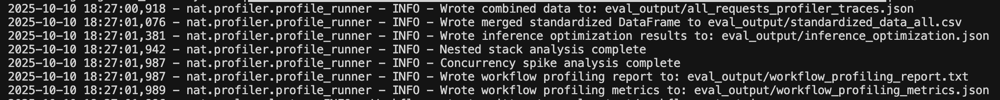
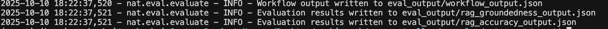

# NVIDIA Flowershop Agent Deployment

This directory contains all the files required for deploying the NeMo Agent Toolkit (NAT) agent as a standalone service.

## Directory Structure

```
agent/
├── src/                    # Agent source code
│   └── nvidia_flowershop/  # Main agent package
├── configs/                # Agent configuration files
├── data/                   # Agent data files
├── pyproject.toml         # Agent deployment dependencies
├── menu.json              # Flowershop menu data
├── env.example            # Environment variables template
└── uv.lock               # Dependency lock file
```

## Prerequisites

Before you begin, ensure you have:
- Python 3.11 or 3.12 installed
- Access to NVIDIA AI services (API key)
- NeMo Agent toolkit installed and configured
- Basic understanding of Python and YAML
- Git and Git LFS (for cloning and managing large files)

## Installation and Setup

### Install NeMo Agent Toolkit

If you haven't already, follow the [installation guide](https://docs.nvidia.com/aiqtoolkit/latest/quick-start/installing.html) to install the NVIDIA Agent Intelligence Toolkit (AIQ).

### Install This Workflow

From the agent directory, install it as a package:

```bash
# Navigate to agent directory
cd agent
# Create a virtual environment
uv venv
uv sync
source .venv/bin/activate
uv pip install -e .
```

This will register the custom functions with the NeMo Agent toolkit system.

### Set Up API Keys

Set your NVIDIA API key as an environment variable:

```bash
export NVIDIA_API_KEY=<YOUR_API_KEY>
```

You can obtain an API key from [build.nvidia.com](https://build.nvidia.com).

**Note**: To use different LLM providers (OpenAI, AWS Bedrock, etc.), update the `llms` section in `configs/config.yml` with your provider endpoints and set the corresponding API keys as environment variables. See the [Workflow Configuration Guide](https://docs.nvidia.com/aiqtoolkit/1.1.0/workflows/workflow-configuration.html) for details.

### Model Selection

This workflow uses **`meta/llama-3.1-70b-instruct`** as the default LLM model. While newer models like `meta/llama-3.3-70b-instruct` are available, we've found that Llama 3.1 70B provides better performance for this specific workflow in terms of:
- **Lower latency**: Faster response times for interactive conversations
- **Response quality**: More consistent and accurate outputs for flower shop queries

You can modify the model in `configs/config.yml` if you want to experiment with different models:

```yaml
llms:
  nim_llm:
    _type: nim
    model_name: meta/llama-3.1-70b-instruct  # Default model
    temperature: 0.0
```

## Test the Workflow Locally

Test your workflow using the `nat run` command:

```bash
# Test with a simple input
nat run --config_file configs/config.yml --input "Hello, can you show me the menu?"
```

**Expected Output:**
The agent should use the menu query functions to provide comprehensive information about available flowers and services.

## Deploy with NAT Serve

### Start the Service

Deploy your workflow as a REST API service:

```bash
# Start the service
nat serve --config_file configs/config.yml --host 0.0.0.0 --port 8000
```

The service will start and be available at `http://localhost:8000`. You can view the auto-generated API documentation at `http://localhost:8000/docs`.

### Test the API

Use curl to test the deployed service:

```bash
curl -X 'POST' \
  'http://localhost:8000/generate' \
  -H 'accept: application/json' \
  -H 'Content-Type: application/json' \
  -d '{
    "input_message": "What flowers do you have available and what are your prices?"
  }'
```

## Enable Phoenix Tracing

### Start Phoenix Server

Phoenix tracing is already configured in your workflow. Start the Phoenix server to view traces:

```bash
# In a new terminal
phoenix serve
```

Phoenix will start and be available at http://0.0.0.0:6006.

### View Traces

1. **Start your workflow**: Run `nat run` or `nat serve` commands
2. **Open Phoenix UI**: Navigate to http://0.0.0.0:6006
3. **Locate traces**: Find your workflow traces under the **Traces** section in projects
4. **View Traces**: Click on individual traces to view:
   - Function calls and responses
   - LLM interactions
   - Tool usage
   - Performance metrics

## Profiling and Evaluation

### Running the Profiler

To run the profiler, simply run the `nat eval` command with the workflow configuration file. The profiler will collect usage statistics and store them in the output directory specified in the configuration file.

```bash
nat eval --config_file configs/config.yml
```

The profiler will execute the workflow and display real-time progress of various analysis stages:



As shown above, the profiler performs comprehensive analysis including:
- Combining profiler trace data
- Merging and standardizing usage statistics
- Computing inference optimization metrics
- Analyzing nested stack traces
- Detecting concurrency spikes
- Generating detailed reports and metrics

This will, based on the configuration, produce the following files in the `output_dir` specified in the configuration file:

- **`all_requests_profiler_traces.json`**: Raw usage statistics collected by the profiler, including traces of LLM and tool input, runtimes, and other metadata.

- **`standardized_data_all.csv`**: Standardized usage data including prompt tokens, completion tokens, LLM input, framework, and other metadata.

- **`inference_optimization.json`**: Computed workflow-specific metrics including 90%, 95%, and 99% confidence intervals for latency, throughput, and workflow runtime.

- **`workflow_profiling_report.txt`**: Human-readable profiling report with detailed analysis and recommendations.

- **`workflow_profiling_metrics.json`**: Detailed profiling metrics in JSON format for programmatic analysis.

- **`workflow_output.json`**: Complete workflow execution results and responses.

- **`gantt_chart.png`**: Visual Gantt chart representation of workflow execution timeline and task durations.

You'll also find a JSON file and text report of any advanced or experimental techniques you ran including concurrency analysis, bottleneck analysis, or PrefixSpan.

For more details on profiling workflows, analyzing performance metrics, and identifying bottlenecks, refer to the [NeMo Agent Toolkit Profiling documentation](https://docs.nvidia.com/aiqtoolkit/1.1.0/workflows/profiler.html).

### Quick Evaluation

Evaluate workflow accuracy using test datasets:

```bash
# Create evaluation dataset (evaluation_data.json)
[
  {
    "question": "What flowers do you have?",
    "ground_truth": "We offer roses, tulips, lilies, and sunflowers"
  }
]

# Run evaluation
nat eval --config_file configs/config.yml --dataset evaluation_data.json

# Evaluate with specific metrics
nat eval --config_file configs/config.yml --dataset evaluation_data.json --metrics accuracy,semantic_similarity
```

**Evaluation Metrics**: Accuracy, semantic similarity, factual accuracy, BLEU score, custom metrics.

**Expected Output**: Detailed evaluation report with scores, per-question breakdown, and improvement recommendations.

### Evaluation Output Files

When you run the evaluation, output files are generated based on the evaluator metrics configured in your `config.yml`. The number and type of files depend on which evaluators you've enabled.



In the configuration example above, we have configured 2 evaluators (`rag_accuracy` and `rag_groundedness`), so the evaluation generates 2 corresponding result files:

```yaml
eval:
  evaluators:
    rag_accuracy:
      _type: ragas
      metric: AnswerAccuracy
      llm_name: nim_rag_eval_llm
    rag_groundedness:
      _type: ragas
      metric: ResponseGroundedness
      llm_name: nim_rag_eval_llm
```

The generated files will include:
- **`workflow_output.json`**: Complete workflow execution results with generated answers
- **`rag_accuracy_results.json`**: Evaluation results for the AnswerAccuracy metric
- **`rag_groundedness_results.json`**: Evaluation results for the ResponseGroundedness metric
- **Summary metrics**: Overall evaluation scores and statistics

If you configure additional evaluators, corresponding result files will be generated for each metric.

### Advanced Usage

```bash
# Continuous evaluation with multiple runs
nat eval --config_file configs/config.yml --dataset eval_data.json --reps 5

# Profile and save results
nat run --config_file configs/config.yml --input "test" --profile --save-profile results.json

# Combine with Phoenix tracing
nat run --config_file configs/config.yml --input "test" --profile --trace
```

## Integrating Custom Agent with Voice-to-Voice Pipeline

### Developing Custom Workflows and Tools
Check out NAT Agent documentation at [Create a New Tool and Workflow](https://docs.nvidia.com/aiqtoolkit/latest/tutorials/create-a-new-workflow.html).

### Understanding Natural Phrases

Natural phrases provide human-like intermediate responses during agent execution. They are defined within each function configuration:

#### Function-Level Natural Phrases
```yaml
functions:
  get_menu:
    _type: get_menu
    file_path: "menu.json"
    natural_phrases:
      - "Let me check the menu for you."
      - "Sure, let me pull up the full menu."
      - "Alright, lets see what we have got today."
  
  get_price:
    _type: get_price
    file_path: "menu.json"
    natural_phrases:
      - "Let me check the price for you."
      - "Sure, checking what that costs."
      - "Alright, lets get the price for that one."
  
  add_to_cart:
    _type: add_to_cart
    file_path: "menu.json"
    natural_phrases:
      - "Let me add that to your cart."
      - "Alright, I have added it to your cart."
      - "Sure thing, adding to your cart."
```

This comprehensive guide helps you create custom NAT agents with natural, human-like intermediate responses that enhance user experience during agent execution.

## Troubleshooting

### Common Issues

1. **Import Errors**: Ensure your workflow is properly installed with `uv sync`

2. **API Key Issues**: Verify your `NVIDIA_API_KEY` environment variable is set

3. **Port Conflicts**: If port 8000 is busy, use a different port:
   ```bash
   nat serve --config_file configs/config.yml --port 8080
   ```

4. **Phoenix Connection Issues**: Ensure Phoenix server is running before starting your workflow

5. **Natural Phrases Not Working**: Verify natural phrases are correctly defined within each function configuration

### Verification Steps

1. **Check registration**: 
   ```bash
   nat info components --types function
   ```

2. **Validate configuration**:
   ```bash
   nat validate --config_file configs/config.yml
   ```

3. **Test connectivity**:
   ```bash
   curl http://localhost:8000/docs
   ```

4. **Monitor traces**: Check Phoenix UI at http://0.0.0.0:6006 for trace data

### File Structure Validation

Ensure your directory structure matches:
- `src/nvidia_flowershop/register.py` - Contains your custom functions
- `configs/config.yml` - Main workflow configuration  
- `menu.json` - Menu data for queries
- `pyproject.toml` - Package configuration with entry points

---

This structured workflow demonstrates best practices for organizing, deploying, and monitoring NeMo Agent toolkit workflows in production environments with comprehensive observability through Phoenix tracing.

## Advanced Configuration

### Production Deployment

For production deployment, consider:

```bash
# Run with multiple workers for better performance
nat serve --config_file configs/config.yml --host 0.0.0.0 --port 8000 --workers 4
```

### Environment Variables

For production, manage configuration through environment variables:

```bash
export NVIDIA_API_KEY=<your_key>
export NAT_LOG_LEVEL=INFO
export NAT_HOST=0.0.0.0
export NAT_PORT=8000
```