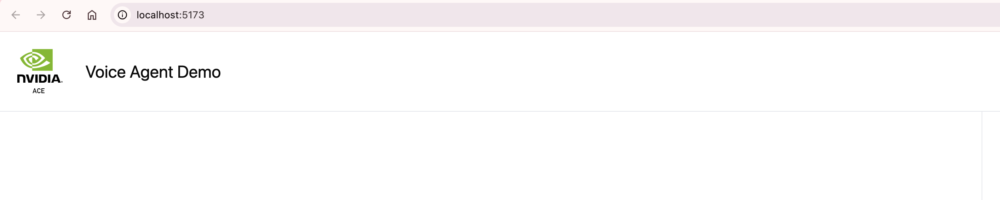

# Speech to Speech Demo

In this example, we showcase how to build a speech-to-speech voice assistant pipeline using WebRTC with real-time transcripts. It uses Pipecat pipeline with FastAPI on the backend, and React on the frontend. This pipeline uses a WebRTC based SmallWebRTCTransport, Riva ASR and TTS models and NVIDIA LLM Service.

## Steps to deploy voice_agent_webrtc application

1. Clone the ace-controller repository:

   ```bash
   git clone https://gitlab-master.nvidia.com/ace/ace-controller.git
   ```

2. Navigate to the example directory:

   ```bash
   cd ace-controller/examples/voice_agent_webrtc
   ```

3. Copy and configure the environment file:

   ```bash
   cp env.example .env  # and add your credentials
   ```

4. Ensure you have the required API keys:
   - NVIDIA_API_KEY - Required for accessing NIM ASR, TTS and LLM models
   - (Optional) ZEROSHOT_TTS_NVIDIA_API_KEY - Required for zero-shot TTS

   Refer to [https://build.nvidia.com/](https://build.nvidia.com/) for generating your API keys.

5. Set up Coturn Server:

   For both Docker and Python deployments, you need to set up a coturn server for WebRTC connectivity.

   Update HOST_IP_EXTERNAL and run the below command:

   ```bash
   docker run -d --network=host instrumentisto/coturn -n --verbose --log-file=stdout --external-ip=<HOST_IP_EXTERNAL>  --listening-ip=<HOST_IP_EXTERNAL>  --lt-cred-mech --fingerprint --user=admin:admin --no-multicast-peers --realm=tokkio.realm.org --min-port=51000 --max-port=52000
   ```

   **Update pipeline.py:**

   Add the following configuration to your `pipeline.py` file to use the coturn server:

   ```python
   ice_servers = [
       IceServer(
           urls="<TURN_SERVER_URL>",
           username="<TURN_USERNAME>",
           credential="<TURN_PASSWORD>"
       )
   ]
   ```

   **Update webrtc_ui/src/config.ts:**

   Add the following configuration to your [`../webrtc_ui/src/config.ts`](../webrtc_ui/src/config.ts) file to use the coturn server:

   ```typescript
   export const RTC_CONFIG: ConstructorParameters<typeof RTCPeerConnection>[0] = {
       iceServers: [
         {
           urls: "<turn_server_url>",
           username: "<turn_server_username>",
           credential: "<turn_server_credential>",
         },
       ],
     };
   ```

6. Deploy the app using either of the options:

### Option 1: Deploy Using Docker

#### Prerequisites

- You have access and are logged into NVIDIA NGC. For step-by-step instructions, refer to [the NGC Getting Started Guide](https://docs.nvidia.com/ngc/ngc-overview/index.html#registering-activating-ngc-account).

- You have access to an NVIDIA Turing™, NVIDIA Ampere (e.g., A100), NVIDIA Hopper (e.g., H100), NVIDIA Ada (e.g., L40S), or the latest NVIDIA GPU architectures. For more information, refer to [the Support Matrix](https://docs.nvidia.com/deeplearning/riva/user-guide/docs/support-matrix.html#support-matrix).

- You have Docker installed with support for NVIDIA GPUs. For more information, refer to [the Support Matrix]((https://docs.nvidia.com/deeplearning/riva/user-guide/docs/support-matrix.html#support-matrix)).

- Before deploying with Docker, ensure your system has at least 3 available GPU devices. If you have fewer GPUs, modify the docker-compose file services to match the number of GPUs on your machine.

```bash
export NGC_API_KEY=nvapi-... # <insert your key>
docker login nvcr.io
```

From the examples/voice_agent_webrtc directory, run below commands:

```bash
docker compose up --build -d
```

This will start all the required services. You should see output similar to the following:


Once all services are up and running, visit `http://<machine-ip>:9000/` in your browser to start interacting with the application. See the next sections for detailed instructions on interacting with the app.

### Option 2: Deploy Using Python Environment

#### Requirements

- Python (>=3.12)
- [uv](https://github.com/astral-sh/uv)

All Python dependencies are listed in `pyproject.toml` and can be installed with `uv`.

### Run

```bash
uv run pipeline.py
```

Then run the UI from [`../webrtc_ui/README.md`](../webrtc_ui/README.md).

## Start interacting with the application

Once all services are up and running, visit `http://<machine-ip>:9000/` in your browser to start interacting with the application. See the next sections for detailed instructions on interacting with the app.



Note: To enable microphone access in Chrome, go to `chrome://flags/`, enable "Insecure origins treated as secure", add `http://<machine-ip>:9000` to the list, and restart Chrome.

## Bot customizations

### Enabling Speculative Speech Processing

Speculative speech processing reduces bot response latency by working directly on Riva ASR early interim user transcripts instead of waiting for final transcripts. This feature only works when using Riva ASR.

- Update `ENABLE_SPECULATIVE_SPEECH` environment variable as `true`  in docker-compose.yml under `python-app` service
- See the [ACE Controller Microservice documentation on Speculative Speech Processing](https://docs.nvidia.com/ace/ace-controller-microservice/1.0/user-guide.html#speculative-speech-processing) for more details.

### Switching ASR, LLM, and TTS Models

You can easily customize ASR (Automatic Speech Recognition), LLM (Large Language Model), and TTS (Text-to-Speech) services by configuring environment variables. This allows you to switch between NIM cloud-hosted models and locally deployed models.

The following environment variables control the endpoints and models:

- `RIVA_ASR_URL`: Address of the Riva ASR (speech-to-text) service (e.g., `localhost:50051` for local, "grpc.nvcf.nvidia.com:443" for cloud endpoint).
- `RIVA_TTS_URL`: Address of the Riva TTS (text-to-speech) service. (e.g., `localhost:50051` for local, "grpc.nvcf.nvidia.com:443" for cloud endpoint).
- `NVIDIA_LLM_URL`: URL for the NVIDIA LLM service. (e.g., `http://<machine-ip>:8000/v1` for local, "https://integrate.api.nvidia.com/v1" for cloud endpoint. )

You can set model, language, and voice using the `RIVA_ASR_MODEL`, `RIVA_TTS_MODEL`, `NVIDIA_LLM_MODEL`, `RIVA_ASR_LANGUAGE`, `RIVA_TTS_LANGUAGE`, and `RIVA_TTS_VOICE_ID` environment variables.

Update these variables in your Docker Compose configuration to match your deployment and desired models. For more details on available models and configuration options, refer to the [NIM NVIDIA Magpie](https://build.nvidia.com/nvidia/magpie-tts-multilingual), [NIM NVIDIA Parakeet](https://build.nvidia.com/nvidia/parakeet-ctc-1_1b-asr/api), and [NIM META Llama](https://build.nvidia.com/meta/llama-3_1-8b-instruct) documentation.

#### Example: Switching to the Llama 3.3-70B Model

To use larger LLMs like Llama 3.3-70B model in your deployment, you need to update both the Docker Compose configuration and the environment variables for your Python application. Follow these steps:

- In your `docker-compose.yml` file, find the `nvidia-llm` service section.
- Change the NIM image to 70B model: `nvcr.io/nim/meta/llama-3.3-70b-instruct:latest`
- Update the `device_ids` to allocate at least two GPUs (for example, `['2', '3']`).
- Update the environment variable under python-app service to `NVIDIA_LLM_MODEL=meta/llama-3.3-70b-instruct`

#### Setting up Zero-shot Magpie Latest Model

Follow these steps to configure and use the latest Zero-shot Magpie TTS model:

1. **Update Docker Compose Configuration**

Modify the `riva-tts-magpie` service in your docker-compose file with the following configuration:

```yaml
 riva-tts-magpie:
  image: <magpie-tts-zeroshot-image:version>  # Replace this with the actual image tag
  environment:
    - NGC_API_KEY=${ZEROSHOT_TTS_NVIDIA_API_KEY}
    - NIM_HTTP_API_PORT=9000
    - NIM_GRPC_API_PORT=50051
  ports:
    - "49000:50051"
  shm_size: 16GB
  deploy:
    resources:
      reservations:
        devices:
          - driver: nvidia
            device_ids: ['0']
            capabilities: [gpu]
```

- Ensure your ZEROSHOT_TTS_NVIDIA_API_KEY key is properly set in your `.env` file:
  ```bash
  ZEROSHOT_TTS_NVIDIA_API_KEY=
  ```

2. **Configure TTS Voice Settings**

Update the following environment variables under the `python-app` service:

```bash
RIVA_TTS_VOICE_ID=Magpie-ZeroShot.Female-1
RIVA_TTS_MODEL=magpie_tts_ensemble-Magpie-ZeroShot
```

3. **Zero-shot Audio Prompt Configuration**

To use a custom voice with zero-shot learning:

- Add your audio prompt file to the workspace
- Mount the audio file into your container by adding a volume in your `docker-compose.yml` under the `python-app` service:
  ```yaml
  services:
    python-app:
      # ... existing code ...
      volumes:
        - ./audio_prompts:/app/audio_prompts
  ```
- Set the `ZERO_SHOT_AUDIO_PROMPT` environment variable to the path relative to your application root:
  ```yaml
  environment:
    - ZERO_SHOT_AUDIO_PROMPT=audio_prompts/voice_sample.wav  # Path relative to app root
  ```

Note: The zero-shot audio prompt is only required when using the Magpie Zero-shot model. For standard Magpie multilingual models, this configuration should be omitted.

