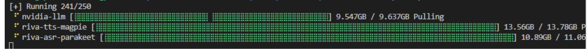
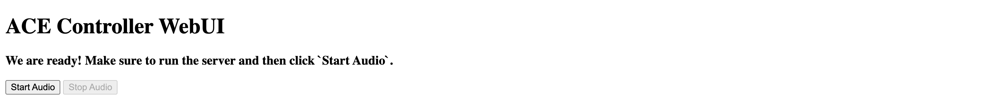

# Speech to Speech Demo with Websocket

In this example, we showcase how to build a simple speech-to-speech voice assistant pipeline using nvidia-pipecat along with pipecat-ai library and deploy for testing. This pipeline uses a Websocket based Websocket Transport, Riva ASR and TTS models and NVIDIA LLM Service. We recommend first following [the Pipecat documentation](https://docs.pipecat.ai/getting-started/core-concepts) to understand core concepts.

## Prerequisites and Setup

1. Clone the voice-agent-examples repository:
    ```bash
    git clone https://github.com/NVIDIA/voice-agent-examples.git
    ```

2. Navigate to the example directory:
    ```bash
    cd voice-agent-examples/examples/voice_agent_websocket
    ```

3. Copy and configure the environment file:
    ```bash
    cp env.example .env  # and add your credentials
    ```

4. Setup API keys in .env file:
   
   Ensure you have the required API keys:
   - NVIDIA_API_KEY - Required for accessing NIM ASR, TTS and LLM models
   - (Optional) ZEROSHOT_TTS_NVIDIA_API_KEY - Required for zero-shot TTS

   Refer to [https://build.nvidia.com/](https://build.nvidia.com/) for generating your API keys.

   Edit the .env file to add your keys or export using:

   ```bash
   export NVIDIA_API_KEY=<YOUR_API_KEY>
   ```

5. Deploy the app using either of the options:

## Option 1: Deploy Using Docker

### Prerequisites

- You have access and are logged into NVIDIA NGC. For step-by-step instructions, refer to [the NGC Getting Started Guide](https://docs.nvidia.com/ngc/ngc-overview/index.html#registering-activating-ngc-account).

- You have access to an NVIDIA Turing™, NVIDIA Ampere (e.g., A100), NVIDIA Hopper (e.g., H100), NVIDIA Ada (e.g., L40S), or the latest NVIDIA GPU architectures. For more information, refer to [the Support Matrix](https://docs.nvidia.com/deeplearning/riva/user-guide/docs/support-matrix.html#support-matrix).

- You have Docker installed with support for NVIDIA GPUs. For more information, refer to [the Support Matrix](https://docs.nvidia.com/deeplearning/riva/user-guide/docs/support-matrix.html#support-matrix).

### Run

```bash
export NGC_API_KEY=nvapi-... # <insert your key>
docker login nvcr.io
```

From the examples/voice_agent_websocket directory, run below commands:

```bash
docker compose up --build -d
```


This will start all the required services. You should see output similar to the following:




Docker deployment might take 30-45 minutes first time. Once all services are up and running, visit `http://WORKSTATION_IP:8100/static/index.html` in your browser to start a session. See next sections for detailed instructions on interacting with the app.

## Option 2: Deploy using Python environment

### Requirements

- Python (>=3.12)
- [uv](https://github.com/astral-sh/uv)

All Python dependencies are listed in `pyproject.toml` and can be installed with `uv`.

### Run

```bash
# Create and activate virtual environment
uv venv
source .venv/bin/activate

# Install dependencies
uv sync
```

Make sure you've configured the `.env` file with your API keys before proceeding.

```bash
python bot.py
```
This will host the static web client along with the voice agent server, visit `http://localhost:8100/static/index.html` in your browser to start a session.


## Start interacting with the application



Note: For mic access, you will need to update chrome://flags/ and add `http://WORKSTATION_IP:8100` in Insecure origins treated as secure section.

If you want to update the port, make changes in the `uvicorn.run` command in [the bot.py](bot.py) and the `wsUrl` in [the static/index.html](./static/index.html).

## Bot pipeline customizations

  ### Speculative Speech Processing

  Speculative speech processing reduces bot response latency by working directly on Riva ASR early interim user transcripts instead of waiting for final transcripts. This feature only works when using Riva ASR. Currently set to true.

  - Toggle using the environment variable `ENABLE_SPECULATIVE_SPEECH`.
    - Docker Compose: set in `python-app.environment` (default is `false`)
      ```yaml
      environment:
        - ENABLE_SPECULATIVE_SPEECH=${ENABLE_SPECULATIVE_SPEECH:-true}
      ```
    - Local run: export before launching
      ```bash
      export ENABLE_SPECULATIVE_SPEECH=true  # or false
      python bot.py
      ```
  - The application will automatically switch processors based on this flag; no code edits needed.
  - See the [Documentation on Speculative Speech Processing](../../docs/SPECULATIVE_SPEECH_PROCESSING.md) for more details.

  ### Switching ASR, LLM, and TTS Models

  You can easily customize ASR (Automatic Speech Recognition), LLM (Large Language Model), and TTS (Text-to-Speech) services by configuring environment variables. This allows you to switch between NIM cloud-hosted models and locally deployed models.

  The following environment variables control the endpoints and models:

  - `RIVA_ASR_URL`: Address of the Riva ASR (speech-to-text) service (e.g., `localhost:50051` for local, "grpc.nvcf.nvidia.com:443" for [cloud endpoint](https://build.nvidia.com/)).
  - `RIVA_TTS_URL`: Address of the Riva TTS (text-to-speech) service. (e.g., `localhost:50051` for local, "grpc.nvcf.nvidia.com:443" for [cloud endpoint](https://build.nvidia.com/)).
  - `NVIDIA_LLM_URL`: URL for the NVIDIA LLM service. (e.g., `http://<machine-ip>:8000/v1` for local, "https://integrate.api.nvidia.com/v1" for [cloud endpoint](https://build.nvidia.com/))

  You can set model, language, and voice using the `RIVA_ASR_MODEL`, `RIVA_TTS_MODEL`, `NVIDIA_LLM_MODEL`, `RIVA_ASR_LANGUAGE`, `RIVA_TTS_LANGUAGE`, and `RIVA_TTS_VOICE_ID` environment variables.

  Update these variables in your Docker Compose configuration to match your deployment and desired models. For more details on available models and configuration options, refer to the [NIM NVIDIA Magpie](https://build.nvidia.com/nvidia/magpie-tts-multilingual), [NIM NVIDIA Parakeet](https://build.nvidia.com/nvidia/parakeet-ctc-1_1b-asr/api), and [NIM META Llama](https://build.nvidia.com/meta/llama-3_1-8b-instruct) documentation.

#### Example: Switching to the Llama 3.3-70B Model

  To use larger LLMs like [Llama 3.3-70B model](https://docs.nvidia.com/nim/large-language-models/latest/supported-models.html#llama-33-70b-instruct) in your deployment, you need to update both the Docker Compose configuration and the environment variables for your Python application. Follow these steps:

  - Check deployment hardware requirements on [NIM Documentation](https://docs.nvidia.com/nim/large-language-models/latest/supported-models.html#llama-33-70b-instruct)
  - Below steps assume 2xH100 for Llama 3.3-70B model and we will need atleast 300 GB filesystem memory.
  - In your `docker-compose.yml` file, find the `nvidia-llm` service section.
  - Change the NIM image to 70B model: `nvcr.io/nim/meta/llama-3.3-70b-instruct:latest`
  - Update the `device_ids` to allocate at least two GPUs (for example, `['2', '3']`).
  - Update the environment variable under python-app service to `NVIDIA_LLM_MODEL=meta/llama-3.3-70b-instruct`
  - If your deployment is GPU VRAM constrained, you can disable KV cache by setting env variable `NIM_ENABLE_KV_CACHE_REUSE=0`

#### Example: Setting up Zero-shot Magpie Latest Model

  Follow these steps to configure and use the latest Zero-shot Magpie TTS model:

  1. **Update Docker Compose Configuration**

  Modify the `riva-tts-magpie` service in your docker-compose file with the following configuration:

  ```yaml
    riva-tts-magpie:
      image: <magpie-tts-zeroshot-image:version>  # Replace this with the actual image tag
      user: "0:0"
      env_file: 
        - path: ./.env
          required: true
      environment:
        - NGC_API_KEY=${ZEROSHOT_TTS_NVIDIA_API_KEY}
        - NIM_HTTP_API_PORT=9000
        - NIM_GRPC_API_PORT=50051
      ports:
        - "19000:9000"
        - "50151:50051"
      healthcheck:
        test: ["CMD-SHELL", "/bin/grpc_health_probe -addr=:50051 || exit 1"]
        interval: 30s
        timeout: 10s
        retries: 10
        start_period: 150s
      volumes:
        - riva_cache:/opt/nim/.cache
      shm_size: 16GB
      restart: unless-stopped
      deploy:
        resources:
          reservations:
            devices:
              - driver: nvidia
                device_ids: ['0']
                capabilities: [gpu]
      logging:
        driver: "json-file"
        options:
          max-size: "50m"
          max-file: "5"
  ```

  - Ensure your ZEROSHOT_TTS_NVIDIA_API_KEY key is properly set in your `.env` file:
    ```bash
    ZEROSHOT_TTS_NVIDIA_API_KEY=
    ```

  2. **Configure TTS Voice Settings**

  Update the following environment variables under the `python-app` service:

  ```bash
  RIVA_TTS_VOICE_ID=Magpie-ZeroShot.Female-1
  RIVA_TTS_MODEL=magpie_tts_ensemble-Magpie-ZeroShot
  ```

  3. **Zero-shot Audio Prompt Configuration**

  To use a custom voice with zero-shot learning:

  - Add your audio prompt file to the workspace
  - Mount the audio file into your container by adding a volume in your `docker-compose.yml` under the `python-app` service:
    ```yaml
    services:
      python-app:
        # ... existing code ...
        volumes:
          - ./audio_prompts:/app/audio_prompts
    ```
  - Set the `ZERO_SHOT_AUDIO_PROMPT` environment variable to the path relative to your application root:
    ```yaml
    environment:
      - ZERO_SHOT_AUDIO_PROMPT=audio_prompts/voice_sample.wav  # Path relative to app root
    ```

  Note: The zero-shot audio prompt is only required when using the Magpie Zero-shot model. For standard Magpie multilingual models, this configuration should be omitted.
